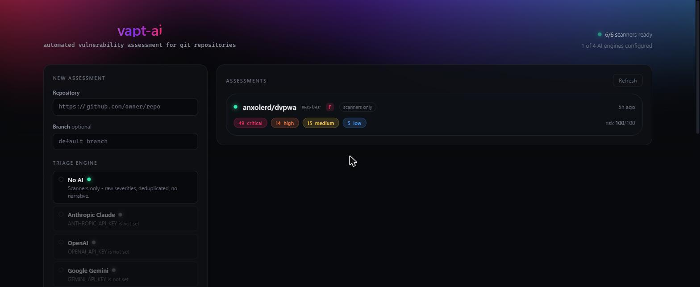
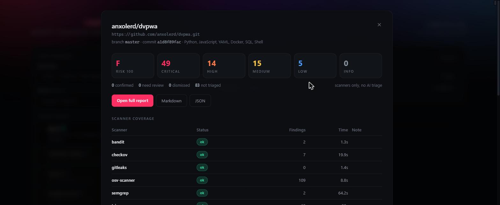

<h1 align="center">vapt-ai</h1>

<p align="center">
  Automated vulnerability assessment for Git repositories.<br>
  Six security scanners, cross-checked and deduplicated, then triaged by the AI engine of your choice.
</p>

<p align="center">
  
  
  
  
  
</p>



Point it at a GitHub or GitLab repository. It clones the code, runs Semgrep,
Bandit, Gitleaks, Trivy, Checkov and OSV-Scanner in parallel, merges findings
that describe the same issue, then has an AI engine read each one against the
surrounding source to decide what is actually real — and writes the report.

It is a **static** assessment: source code, dependencies, secrets and
infrastructure config. It does not deploy or attack a running application.

```bash
git clone https://github.com/sanket999999999/literate-engine-ai-vapt.git
cd literate-engine-ai-vapt
python -m venv .venv
.venv\Scripts\activate                          # source .venv/bin/activate on Unix
pip install -r requirements.txt
python scripts/install_tools.py
cd frontend && npm install && npm run build && cd ..
python run.py                                      # http://127.0.0.1:8000
```

No API key needed to start — **No AI** mode runs the scanners and produces a
full report on its own.

---

## What it checks

| Scanner | Category | What it catches |
| --- | --- | --- |
| **Semgrep** | SAST | Injection, unsafe deserialization, path traversal and ~30 other classes, across 30+ languages |
| **Bandit** | SAST | Python-specific insecure API use, weak crypto, shell injection |
| **Gitleaks** | Secrets | API keys, tokens and credentials — optionally across the whole commit history |
| **Trivy** | Deps + IaC | Lockfile CVEs, plus Dockerfile / Kubernetes / Terraform misconfiguration |
| **Checkov** | IaC | Policy-as-code checks for Terraform, K8s, Dockerfiles, CI pipelines |
| **OSV-Scanner** | Deps | Transitive dependency CVEs resolved from lockfiles via the OSV database |

Findings from different scanners that describe the same issue are merged into
one, and the survivor records which other scanners agreed — a CVE reported by
both Trivy and OSV-Scanner appears once, tagged `also: trivy`.

## Triage engines

Scanners are noisy and severity-blind. The triage layer reads each finding
together with the surrounding source and decides what is actually real. Pick the
engine per scan, in the dashboard or via the API:

| Engine | Cost | Notes |
| --- | --- | --- |
| **No AI** | free | Scanners only. Raw severities, deduplicated, no narrative. Always available. |
| **Anthropic Claude** | paid | Best quality, and the default when configured. Opus 5, Sonnet 5 or Haiku 4.5. |
| **OpenAI** | paid | GPT-5 / 4.1 / o4-mini with strict JSON schema output. |
| **Google Gemini** | paid | Flash tiers are the cheapest cloud option for large scans. |
| **Ollama** | free | Runs on your machine. Nothing is sent anywhere. Quality depends on the model. |

Whichever engine you choose, it:

- **decides whether each finding is real** — `true_positive`, `false_positive`
  (test fixture, sanitized input, unreachable code, placeholder secret) or
  `needs_review` when the deciding context was not available;
- **re-scores severity for your codebase** — an injection on an unauthenticated
  endpoint outranks the same rule in an offline admin script;
- **writes the attack scenario and the specific fix**, naming the function or
  setting to change;
- **writes the report narrative** — executive summary, risk themes, prioritized
  remediation plan.

Dismissed findings are not deleted; they are listed separately with the reason.

Only providers with a configured key appear as selectable. A provider that is
not usable is shown greyed out with the exact reason (`OPENAI_API_KEY is not
set`), and choosing one anyway fails immediately at submit rather than ten
minutes into a scan.

Each scan records which engine ran it, how many requests it made, and what it
cost — visible in the detail view and the report footer. Local runs report $0.

## Setup

```bash
# 1. Python dependencies (semgrep, bandit, checkov come from PyPI)
python -m venv .venv
.venv\Scripts\activate          # Windows
# source .venv/bin/activate     # macOS / Linux
pip install -r requirements.txt

# 2. The Go-based scanners, fetched into ./tools/
python scripts/install_tools.py

# 3. The dashboard, built into the backend so one process serves everything
cd frontend && npm install && npm run build && cd ..

# 4. Configuration
copy .env.example .env          # cp on macOS / Linux
```

Then put a key for whichever engine you want in `.env`:

```ini
ANTHROPIC_API_KEY=sk-ant-...     # or OPENAI_API_KEY / GEMINI_API_KEY
```

Or skip keys entirely: **No AI** always works, and **Ollama** works with any
local model (`ollama pull qwen2.5-coder:7b`).

Run it:

```bash
python run.py                   # http://127.0.0.1:8000
```

The dashboard's **Scanners** panel shows which tools were found. Anything
missing is skipped with a note in the report rather than failing the scan, so a
partial install still works.

> A virtualenv is strongly recommended — `semgrep` and `checkov` pin a lot of
> transitive dependencies and will happily upgrade packages other projects rely
> on if installed globally.

---

## Using it

**Dashboard** — paste a repo URL, pick the options, watch the progress bar. Each
completed scan opens to a detail view with severity filters and links to the
full report in HTML, Markdown or JSON.



**API** — the same thing without the browser:

```bash
# Start a scan
curl -X POST http://127.0.0.1:8000/api/scans \
  -H "Content-Type: application/json" \
  -d '{"repo_url": "https://github.com/owner/repo", "provider": "anthropic"}'

# Poll it
curl http://127.0.0.1:8000/api/scans/<id>

# Get the report
curl "http://127.0.0.1:8000/api/scans/<id>/report?fmt=md" -o report.md
```

| Endpoint | Purpose |
| --- | --- |
| `GET /api/health` | Whether AI triage is configured |
| `GET /api/tools` | Which scanners are installed |
| `GET /api/providers` | Which triage engines are configured |
| `POST /api/scans` | Queue a scan (`repo_url`, `branch`, `deep_history`, `provider`, `model`) |
| `GET /api/scans` | Recent scans |
| `GET /api/scans/{id}` | Status, progress, summary, narrative |
| `GET /api/scans/{id}/findings` | Findings, filterable by `severity` / `category` |
| `GET /api/scans/{id}/report?fmt=html\|md\|json` | Rendered report |
| `DELETE /api/scans/{id}` | Delete a scan and its report |

Interactive API docs are at `/docs`.

### Scan options

- **`branch`** — defaults to the repository's HEAD.
- **`deep_history`** — clones the full history so Gitleaks can walk every commit
  for secrets that were committed and later removed. Slower, and the only way to
  catch a credential that is no longer in the working tree.
- **`provider`** — `auto` (first configured), `none`, `anthropic`, `openai`,
  `gemini` or `ollama`.
- **`model`** — model id for that provider. Empty uses its default.

### Private repositories

Set `GITHUB_TOKEN` or `GITLAB_TOKEN` in `.env`. Tokens are injected into the
clone URL at runtime and stripped from any error message that gets logged or
returned.

---

## How it works

```
POST /api/scans
      │
      ▼
  clone (shallow, or full for history scanning)
      │
      ▼
  six scanners in parallel ──► raw findings
      │
      ▼
  normalize ──► deduplicate ──► attach ±6 lines of source context
      │
      ▼
  AI triage (Claude / OpenAI / Gemini / Ollama / none),
  worst findings first, batched and prompt-cached
      │
      ▼
  SQLite  +  HTML / Markdown / JSON report
```

The clone is deleted as soon as the code context has been copied into the
findings; only results are retained.

### Cost control

Triage batches 12 findings per request and caches the system prompt, so a repeat
scan of a similar codebase mostly reads from cache. Findings are triaged
worst-first and capped at `VAPT_TRIAGE_MAX_FINDINGS` (default 400) so a
pathological repo cannot run up an unbounded bill. Every scan records its own
token usage and estimated cost, visible in the detail view and the report
footer.

### Configuration

| Variable | Default | Purpose |
| --- | --- | --- |
| `ANTHROPIC_API_KEY` | — | Enables the Claude engine |
| `OPENAI_API_KEY` | — | Enables the OpenAI engine |
| `GEMINI_API_KEY` | — | Enables the Gemini engine |
| `OLLAMA_HOST` | `http://127.0.0.1:11434` | Where the local Ollama server is |
| `VAPT_PROVIDER` | `auto` | Default engine: `auto`, `none`, or a provider key |
| `VAPT_MODEL` | provider default | Default model |
| `GITHUB_TOKEN` / `GITLAB_TOKEN` | — | Private repo access |
| `VAPT_DATA_DIR` | `./data` | Clones, database and reports |
| `VAPT_SCANNER_TIMEOUT` | `900` | Per-scanner wall-clock limit (seconds) |
| `VAPT_MAX_CONCURRENT_SCANS` | `2` | Scans running at once |
| `VAPT_TRIAGE_BATCH_SIZE` | `12` | Findings per Claude request |
| `VAPT_TRIAGE_MAX_FINDINGS` | `400` | Triage budget cap per scan |
| `VAPT_SEMGREP_CONFIG` | `p/security-audit,p/owasp-top-ten,p/secrets` | Semgrep rulesets |

---

## Adding a scanner

Subclass `Scanner`, translate the tool's output into `Finding` objects, and add
the class to `SCANNER_CLASSES` in `vapt/scanners/__init__.py`. The pipeline, the
dashboard's tool panel and the report all pick it up from there.

```python
class MyScanner(Scanner):
    name = "mytool"
    category = "sast"              # sast | secret | dependency | iac
    install_hint = "pip install mytool"

    def command(self):
        return find_python_tool("mytool", "mytool")

    def scan(self, repo: Path, workdir: Path) -> list[Finding]:
        run_command([*self.command(), "--json", "-o", str(workdir / "out.json"), "."],
                    cwd=repo, ok_codes=(0, 1))
        return [to_finding(r) for r in load_json(workdir / "out.json")["results"]]
```

A scanner that raises is reported as `error` for that tool alone — the rest of
the scan still completes, and the report says what was missed.

---

## Layout

```
vapt/
  api.py          FastAPI app, worker pool, REST endpoints
  pipeline.py     clone → scan → triage → persist → report
  scanners/       one module per tool, plus the registry
  providers/      one module per AI engine, plus the registry
  triage.py       provider-agnostic batching, budget cap, prompts
  findings.py     normalized Finding, dedupe, source context
  report.py       HTML / Markdown / JSON rendering
  repo.py         URL validation and cloning
  db.py           SQLAlchemy models
  web/dist/       the built dashboard (generated)
frontend/         Vite + React + Tailwind dashboard
  src/components/reactbits/   React Bits components
scripts/
  install_tools.py   fetches gitleaks, trivy, osv-scanner
tests/
  test_parse_batch.py   triage response parsing
```

### Working on the dashboard

```bash
python run.py                   # API on :8000
cd frontend && npm run dev      # HMR on :5173, proxies /api to :8000
```

`npm run build` writes into `vapt/web/dist/`, which the backend serves at `/`.

### Adding an AI engine

Subclass `TriageProvider` (implement `available()`, `triage_batch()` and
`narrative()`), then add it to `PROVIDER_CLASSES` in `vapt/providers/__init__.py`.
The dashboard picker, the API validation and the cost accounting all read from
that registry. Providers that do not enforce a JSON schema can reuse
`parse_batch()`, which tolerates code fences, reasoning blocks and preamble.

---

## Credits

The scanners do the detection work, and each is excellent at its own job:
[Semgrep](https://github.com/semgrep/semgrep),
[Bandit](https://github.com/PyCQA/bandit),
[Gitleaks](https://github.com/gitleaks/gitleaks),
[Trivy](https://github.com/aquasecurity/trivy),
[Checkov](https://github.com/bridgecrewio/checkov) and
[OSV-Scanner](https://github.com/google/osv-scanner).

The dashboard's animated components come from
[React Bits](https://reactbits.dev) (MIT), vendored into
`frontend/src/components/reactbits/`.

---

## Scope and limitations

- **Static analysis only.** No running application is tested, so anything that
  only appears at runtime — authentication logic, access control between users,
  business-logic flaws, server configuration — is out of scope.
- **Scanner coverage is the ceiling.** AI triage filters and explains what the
  scanners found; it does not independently audit code they never flagged.
- **`needs_review` findings are unresolved,** not safe. They are the ones a
  human should look at first.
- **Scan only repositories you are authorized to test.**
